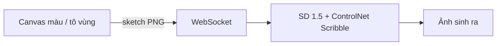

# Sketch-to-Fashion

Web app vẽ sketch thời trang (màu, tô vùng kiểu Paint) → sinh ảnh trang phục photorealistic.

**Demo:** canvas bên trái · ảnh sinh ra bên phải · nhấn **Tạo ảnh** khi sẵn sàng.

---

## Từ project cũ đến project này

Project này là **phiên bản làm lại** dựa trên kinh nghiệm từ đồ án nhóm trước:

**[Sketch-to-Image-by-Pix2Pix](https://github.com/lqb464/Sketch-to-Image-by-Pix2Pix)** — tái hiện và mở rộng Pix2Pix cho sketch → image trên các dataset `facades`, `edges2shoes`, `CUFS`.

### Vì sao làm lại?

| Vấn đề (Pix2Pix cũ) | Hướng xử lý (project này) |
|---------------------|---------------------------|
| Sketch train từ **edge map** (Canny/dilate ảnh thật), không phải nét vẽ tay | Dùng **ControlNet Scribble** — pretrained trên sketch/scribble tự do của người |
| Sketch đầu vào phải **khớp viền** ảnh output (cặp A\|B căn chỉnh chặt) | Chấp nhận sketch **xấu, lệch, có màu** — phù hợp vẽ tay trên canvas |
| Phải **train từ đầu**, cần checkpoint `.pth`, dataset lớn | Dùng model **pretrained HuggingFace** — không cần train để chạy demo |
| UI chỉ **upload file** sketch | **Canvas vẽ trực tiếp**: bút màu, tô vùng, tẩy, hoàn tác |
| Kết quả fashion **không ổn định** trên sketch lỏng | Kết hợp sketch (ControlNet) + mô tả loại trang phục (text prompt) |

### So sánh mô hình

```
Project cũ:  Sketch (edge map) ──► U-Net Pix2Pix (train) ──► Ảnh
Project mới: Sketch (màu/tự do) ──► SD 1.5 + ControlNet Scribble + LCM ──► Ảnh
                                      ▲
                                      └── text: "a red shirt, fashion design..."
```

**Pix2Pix** vẫn hợp lý khi có dataset cặp sketch–ảnh chất lượng cao và sketch đúng format. Với use case **người dùng vẽ tay trên app**, diffusion + ControlNet phù hợp hơn vì có prior mạnh từ pretrain và chịu sketch không hoàn hảo.

---

## Kiến trúc

```
Sketch-to-Fashion/
├── backend/     FastAPI + WebSocket + diffusers (inference)
├── frontend/    React + Vite + canvas vẽ (Paint-style)
└── training/    Pipeline train LoRA + ControlNet (Kaggle)
```



### Model (tự tải lần đầu, ~5GB)

| Thành phần | HuggingFace |
|------------|-------------|
| Base | `runwayml/stable-diffusion-v1-5` |
| ControlNet | `lllyasviel/sd-controlnet-scribble` |
| Tăng tốc (tuỳ chọn) | `latent-consistency/lcm-lora-sdv1-5` — bật bằng `USE_LCM=true` |

Không cần train hay checkpoint riêng để chạy demo (dùng pretrained Scribble). **Có sẵn pipeline train** trong thư mục [`training/`](training/) — xem [`training/README.md`](training/README.md) để train trên Kaggle (FashionSD-X: LoRA + ControlNet trên Dress Code).

Inference chạy **local** (không gọi API bên thứ ba).

---

## Tính năng app

- Vẽ **bút màu**, **tô vùng** (flood fill), **tẩy**, hoàn tác, xóa hết
- Bảng màu preset + chọn màu tuỳ ý
- Chọn loại trang phục: Áo / Quần / Nón / Váy / Áo khoác
- Gợi ý phong cách (tuỳ chọn): *denim xanh*, *lụa đỏ*…
- Nhấn **Tạo ảnh** để sinh (không tự chạy liên tục — tiết kiệm CPU/GPU)
- CPU: sinh ảnh ~30–90s · GPU: streaming nhanh hơn

---

## Yêu cầu hệ thống

| | |
|---|---|
| Python | 3.11+ |
| Node.js | 18+ (LTS) |
| RAM | ≥8GB khuyến nghị |
| GPU | Tuỳ chọn — NVIDIA ≥8GB VRAM cho realtime |
| Disk | ~5GB cho model cache (lần đầu) |
| Internet | Lần đầu chạy backend (tải model) |

---

## Cài đặt & chạy

Cần **2 terminal** song song.

### Terminal 1 — Backend

```bash
cd backend
python -m venv .venv
```

**Windows (khuyến nghị):**
```powershell
cd backend
.\run.ps1
```

**Windows (thủ công):**
```powershell
.venv\Scripts\activate
pip install -r requirements.txt
python -m uvicorn main:app --reload --host 127.0.0.1 --port 8001
```

> Cần **Visual C++ Redistributable x64** nếu PyTorch báo lỗi `c10.dll`.

**Linux / macOS:**
```bash
source .venv/bin/activate
pip install -r requirements.txt
uvicorn main:app --reload --host 127.0.0.1 --port 8001
```

> **Port 8000 bị chiếm trên Windows?** Dùng `8001` như trên. Frontend đã proxy sẵn tới `8001` trong `frontend/vite.config.ts`.

Đợi log:
```
[INFO] Pipeline loaded successfully.
[INFO] Inference engine ready (cpu, streaming=False)
```

Kiểm tra: http://127.0.0.1:8001/api/health → JSON `"status":"ok"`.

Lần đầu tải model có thể mất **10–30 phút** tùy mạng.

### Terminal 2 — Frontend

```bash
cd frontend
npm install
npm run dev
```

Mở trình duyệt: **http://localhost:5173**

---

## Cách dùng

1. Chọn loại trang phục và (tuỳ chọn) phong cách / chất liệu
2. Vẽ viền, tô màu trên canvas trái
3. Nhấn **Tạo ảnh** bên phải
4. Đợi kết quả (CPU: ~30–90 giây)
5. **Tải ảnh** để lưu kết quả

**Mẹo:** Vẽ viền đen + tô màu vùng áo/quần giúp model hiểu hình dáng và màu sắc tốt hơn sketch một màu.

---

## Biến môi trường (backend)

| Biến | Mặc định | Mô tả |
|------|----------|-------|
| `DEVICE` | `auto` | `cpu`, `cuda`, hoặc `auto` |
| `RESOLUTION` | `384` (CPU) / `512` (GPU) | Kích thước output |
| `NUM_INFERENCE_STEPS` | `25` (fashion) / `4` (LCM) | Số bước diffusion |
| `GUIDANCE_SCALE` | `7.5` (fashion) / `1.0` (LCM) | Classifier-free guidance |
| `CONTROLNET_CONDITIONING_SCALE` | `0.6` (fashion) / `0.8` | Độ bám sketch (0–1) |
| `CONTROLNET_MODEL_ID` | `lllyasviel/sd-controlnet-scribble` | ControlNet path hoặc HF repo |
| `FASHION_LORA_PATH` | *(empty)* | Path LoRA sau khi train (stage 1) |
| `USE_LCM` | `false` | Bật LCM 4-step (demo nhanh, tắt khi dùng model train) |
| `SKETCH_PREPROCESS` | `adaptive` | `adaptive` / `canny` / `none` — convert canvas → edge sketch |
| `PORT` | `8000` | Port uvicorn (nếu chạy `python main.py`) |

Ví dụ GPU:
```bash
set DEVICE=cuda          # Windows
export DEVICE=cuda       # Linux/macOS
uvicorn main:app --host 127.0.0.1 --port 8001
```

---

## WebSocket API (tham khảo)

**Endpoint:** `ws://127.0.0.1:8001/ws/generate`

```json
// Client → Server
{
  "type": "generate",
  "sketch": "<base64 PNG>",
  "category": "shirt",
  "style": "casual blue",
  "request_id": "uuid"
}

// Server → Client
{ "type": "progress", "message": "Generating on CPU..." }
{ "type": "done", "image": "<base64 JPEG>" }
```

---

## Hạn chế & hướng cải thiện

- Model **general-purpose**, chưa fine-tune riêng fashion → chất lượng demo, có thể lệch kỳ vọng
- **CPU rất chậm** — khuyến nghị GPU cho trải nghiệm mượt
- Text prompt (loại trang phục) **hỗ trợ** sketch, không thay thế hoàn toàn

Hướng phát triển:

- Train **LoRA + ControlNet** theo [`training/README.md`](training/README.md) (FashionSD-X trên Dress Code)
- Sau train: trỏ `FASHION_LORA_PATH` và `CONTROLNET_MODEL_ID` về weights Kaggle

---

## Liên quan

- **Project trước (Pix2Pix):** https://github.com/lqb464/Sketch-to-Image-by-Pix2Pix
- **Pix2Pix gốc:** https://github.com/junyanz/pytorch-CycleGAN-and-pix2pix
- **ControlNet Scribble:** https://huggingface.co/lllyasviel/sd-controlnet-scribble
- **TexControl** (sketch fashion + diffusion): https://arxiv.org/html/2405.04675

---

## License

MIT — see [LICENSE](LICENSE)
